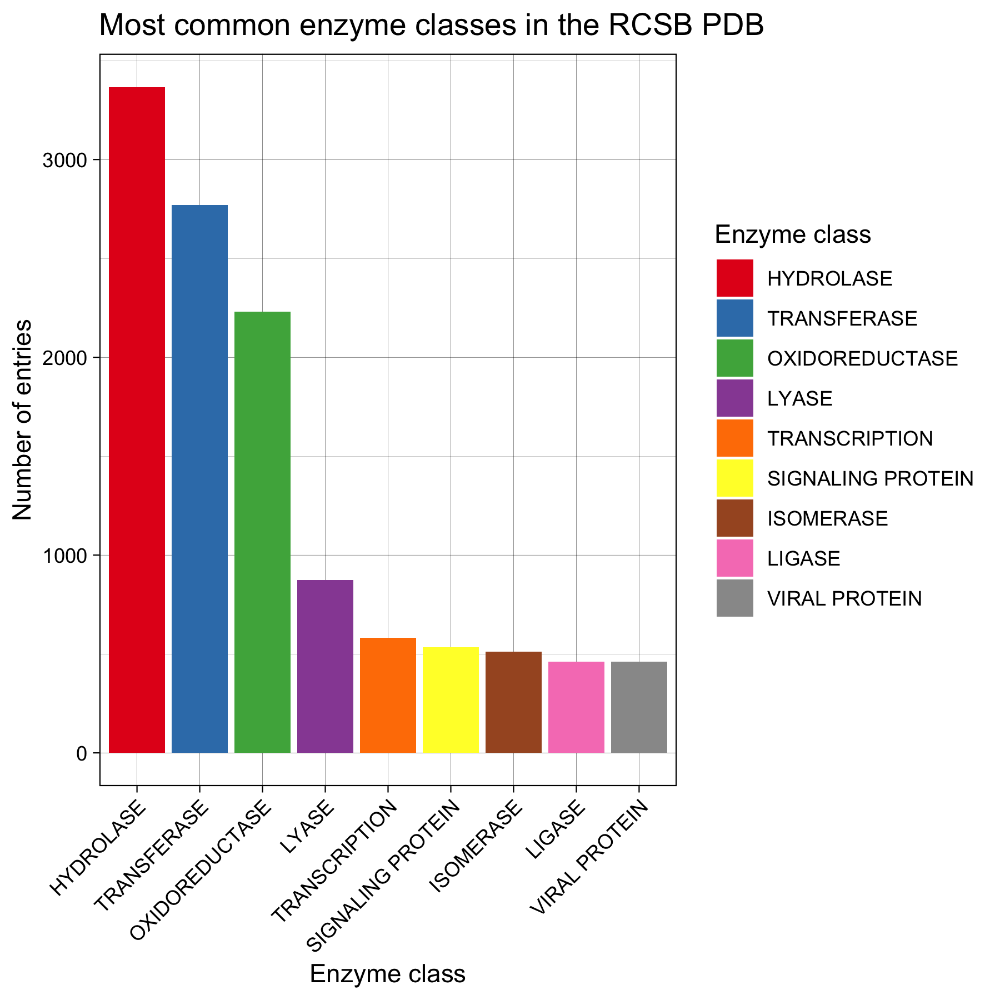
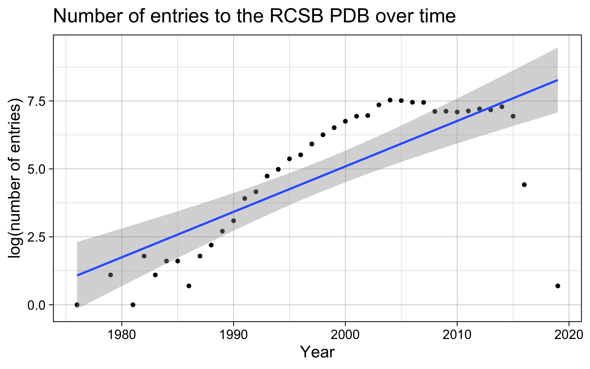

# README
____
# 2022_group12_final_project
____
This it the GitHub repository for the final project of the R for Bio Data Science
course at DTU. The project was done by:

  - Deeptha Sri - s210230
  - Eric Bautista - s212514
  - Jonathan Funk - s212697
  - Laura Machado - s212775
  
## Introduction
____
The objective of our final project was to analyze the meta-data of the [RCSB protein
data bank](https://www.rcsb.org/stats)

The data was analyzed using5 R tidyverse](https://www.tidyverse.org/). The project
structure is inspired by the [Josh Reich’s](https://twitter.com/i2pi) 
[Load-clean-func-do-thought](https://stackoverflow.com/questions/1429907/workflow-for-statistical-analysis-and-report-writing/1434424#1434424) and this 2009 paper by 
[William Stafford Noble](https://twitter.com/thabangh).

## Data
____
We combined data from different sources for our analysis, namely:

- [Protein Data Bank (PDB)](https://www.rcsb.org/stats)
- [National Center for Biotechnology Information (NCBI)](https://www.ncbi.nlm.nih.gov/)
- [Structural Classification Of Proteins (SCOP)](https://scop.berkeley.edu/)

which were accessed on the 03/05/2022.

## Data analysis pieline
____
The data was processed and analyzed based on a flowchart below:

{width=75%}

## Results
____
We recreated pie charts which are on the RCSB and visalized the data as bar plots.
some of the categories which were chosen by creators of the plots were changed
during this project based on our preferences:

{width=45%}

{width=45%}

{width=45%}

{width=45%}

{width=45%}

{width=45%}

{width=40%}

{width=40%}

