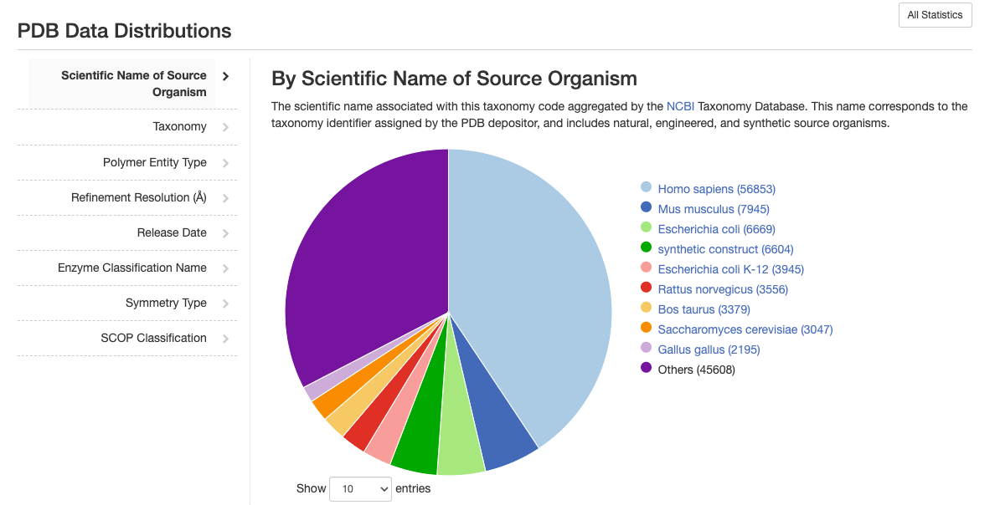
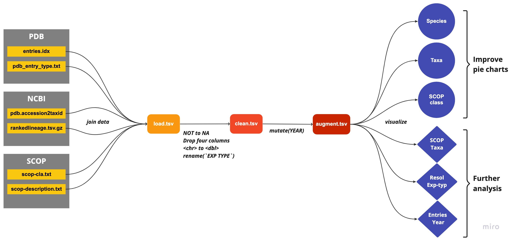
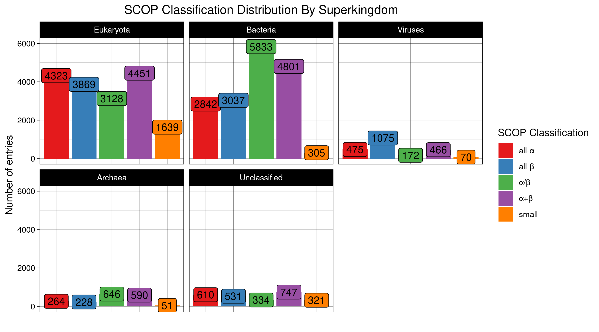

```{r setup, include=FALSE}
knitr::opts_chunk$set(echo = FALSE)
```

## Intoduction {.smaller}

- what we want to do?
- why do we want to do it?
- show the problem (some example plots)

{width=65%}

## Materials and Methods {.smaller}

From raw data to visualizations
{width=99.9%}

## Results: Bar plots I {.smaller}

Source organism

## Results: Bar plots II {.smaller}

Superkingdom

## Results: Bar plots III {.smaller}

SCOP class

## Results: Further Analysis I {.smaller}

```{r Results_I, echo = TRUE, eval = FALSE}
pdb_taxa_mol <- taxonomy_df %>%
  group_by(SUPERKINGDOM, `MOLECULE TYPE`) %>% 
  add_tally(name = "n") %>% 
  distinct(SUPERKINGDOM, `MOLECULE TYPE`, n)
```

{width=90%} 


## Results: Further Analysis II {.smaller}

```{r Results_II, echo = TRUE, eval = FALSE}
pdb_entries_aug %>% 
  select(IDCODE, RESOLUTION, `EXPERIMENT TYPE`) %>% 
  filter(RESOLUTION < 5)
```

{width=99%} 

## Results: Further Analysis III {.smaller}

Linear model

## Discussion 

- Just a snapshot

- DB latest version

- Choose join type wisely

## End
