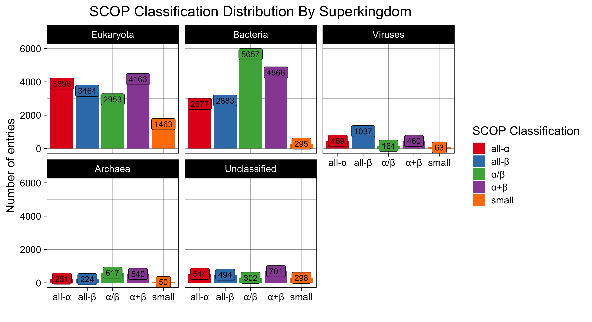
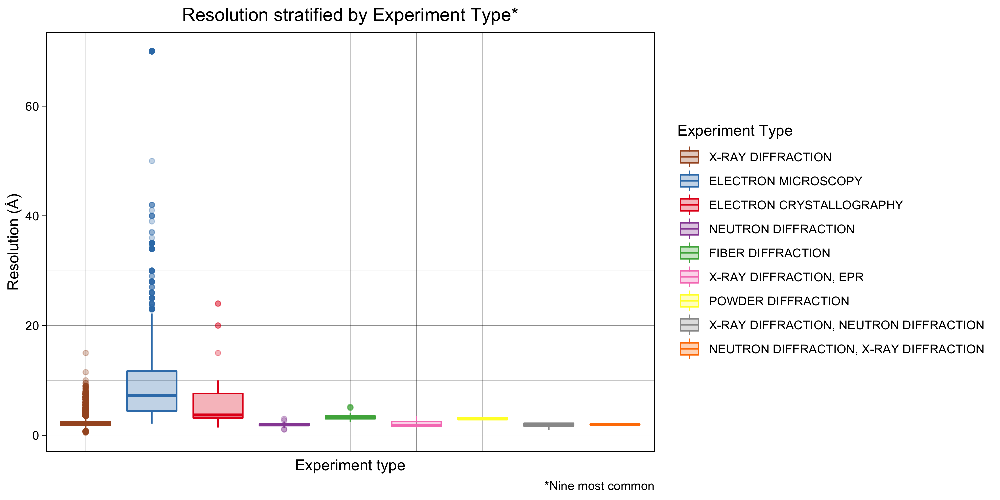
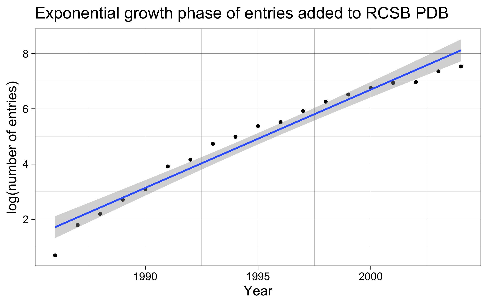

```{r setup, include=FALSE}
knitr::opts_chunk$set(echo = FALSE)
```

## Intoduction {.smaller}

The Research Collaboratory for Structural Bioinformatics - Protein Data Bank (RCSB-PDB) 

- An open archive of experimental 3D structures
- Estimated 1 Million unique users annually

<div class="centered">
{width=50%}
</div>


## Intoduction {.smaller}

{width=90%}


## Materials and Methods {.smaller}

From raw data to visualizations
{width=99.9%}

## Results: Bar plots I {.smaller .centered}
{width=50%}

{width=70%}

## Results: Bar plots II {.smaller .centered}

{width=50%}
{width=70%}

## Results: Bar plots III {.smaller .centered}

{width=60%}
{width=70%}

## Results: Further Analysis I {.smaller}

```{r Results_I, echo = TRUE, eval = FALSE}
pdb_taxa_mol <- taxonomy_df %>%
  group_by(SUPERKINGDOM, `MOLECULE TYPE`) %>% 
  add_tally(name = "n") %>% 
  distinct(SUPERKINGDOM, `MOLECULE TYPE`, n)
```

{width=90%} 


## Results: Further Analysis II {.smaller}

```{r Results_II, echo = TRUE, eval = FALSE}
pdb_entries_aug %>% 
  select(IDCODE, RESOLUTION, `EXPERIMENT TYPE`) %>% 
  filter(`EXPERIMENT TYPE` %in% exp_type_levels)
```

{width=99%} 

## Results: Further Analysis III {.smaller}

- Linear regression using logarithmic y scale
- exponential growth phase (late 80's until 2000's)

{width=49%}
{width=49%}

## Discussion 

1. Successfully improved the PDB metadata visualizations

2. Database updates compromise reproducibility

3. Greatest challenge: combining files from different sources

4. Further analysis to account for redundancy.

<div class="centered">
{width=30%}
{width=15%}
{width=30%}
</div>

## Acknowledgements {.smaller}

### Acknowledgements

- TAs
- Online community

### References
Pie charts: https://www.rcsb.org/stats/
