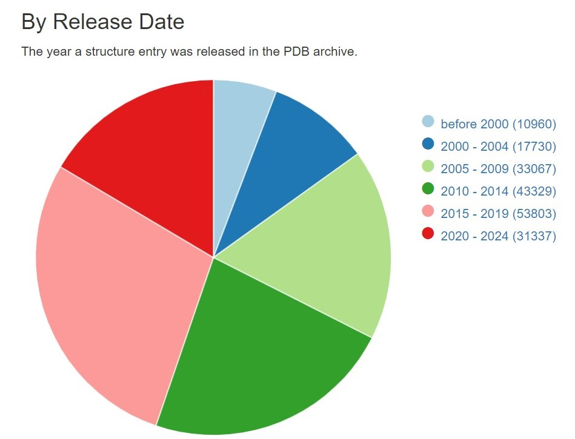

```{r setup, include=FALSE}
knitr::opts_chunk$set(echo = FALSE)
```

## Introduction

The Research Collaboratory for Structural Bioinformatics - Protein Data Bank (RCSB-PDB) 

- An open archive of experimental 3D structures
- Estimated 1 Million unique users annually

{width=50%} 


## Re-creation of PDB Data Statitics

{width=70%} 

## Re-creation of PDB Data Statitics

{width=70%}

## Re-creation of PDB Data Statitics

{width=70%}

## Re-creation of PDB Data Statitics

{width=70%}
