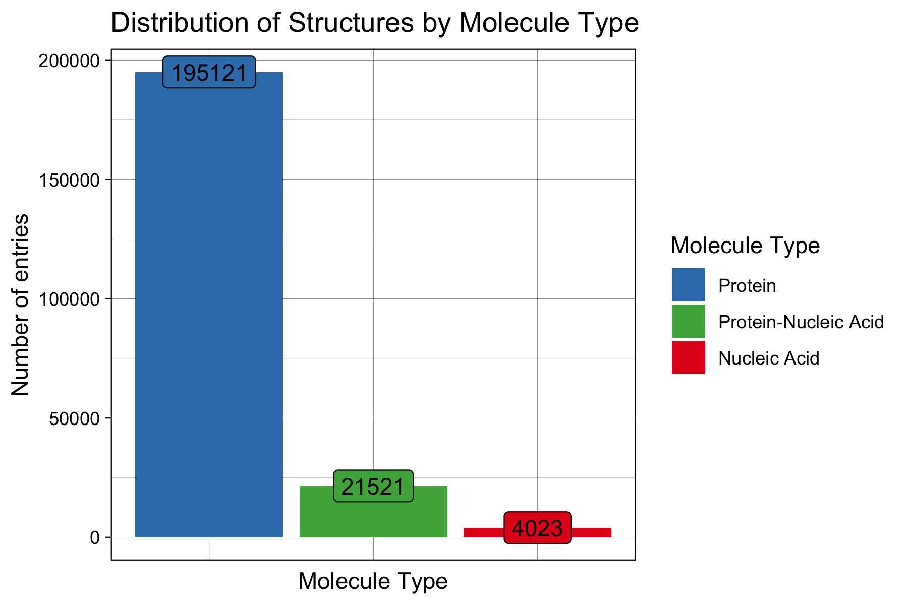
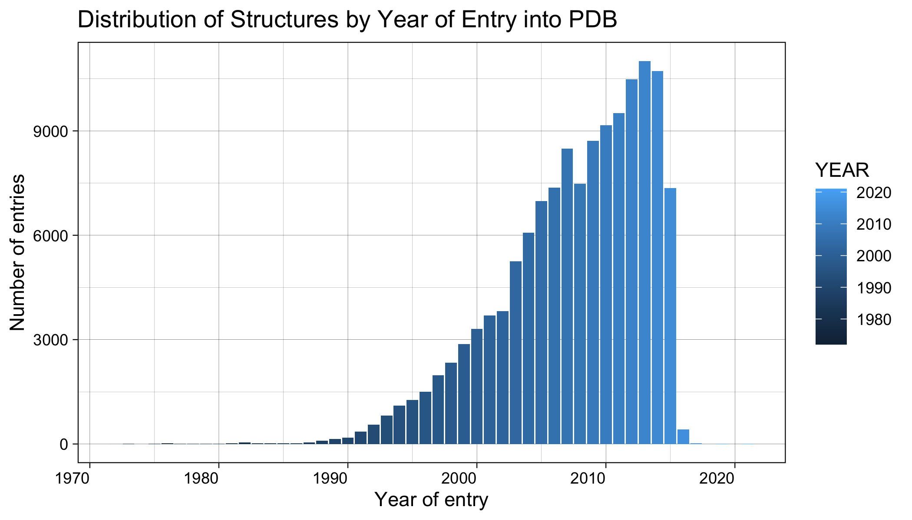
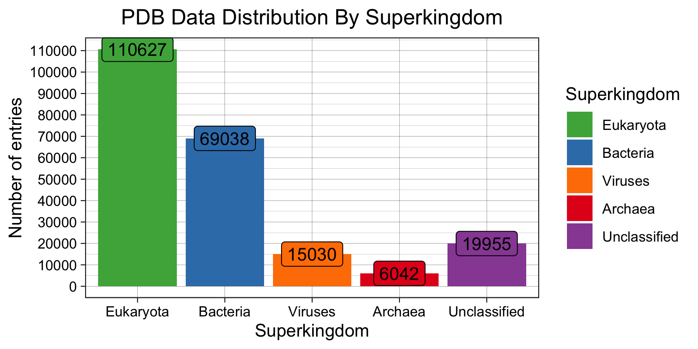

```{r setup, include=FALSE}
knitr::opts_chunk$set(echo = FALSE)
```

## Introduction

The Research Collaboratory for Structural Bioinformatics - Protein Data Bank (RCSB-PDB) 

- An open archive of experimental 3D structures
- Estimated 1 Million unique users annually

{width=50%} 


## Re-creation of PDB Data Statitics

{width=70%} 

## Re-creation of PDB Data Statitics

{width=51%}{width=49%}


## Re-creation of PDB Data Statitics

{width=60%}

## Re-creation of PDB Data Statitics

{width=70%} 


## Re-creation of PDB Data Statistics

{width=60%}{width=40%}

## Re-creation of PDB Data Statistics

{width=60%}{width=40%} 


##Trial slide

```{r image_grobs, fig.show = "hold", out.width = "50%", fig.align = "default"}

knitr::include_graphics("source_plot.jpg")

knitr::include_graphics("source_pdb.jpg")

```