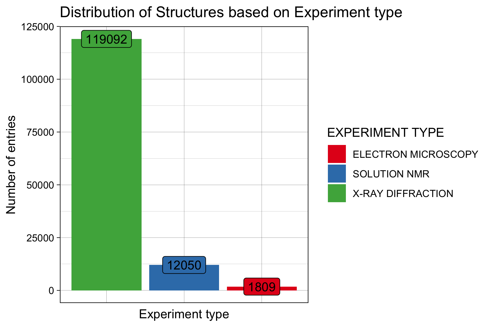

```{r setup, include=FALSE}
knitr::opts_chunk$set(echo = FALSE)
```

## Introduction

-Bioinformatic tools such as AlphaFold has PDB as a source for training the prediction of 3D structures of proteins

-Models with better predictions could be the result of bias from the types of proteins that have been studied extensively

-The problem: The data present in the https://www.rcsb.org/stats did not provide the insights we needed for this


## Re-creation of PDB Data Statitics

{width=70%} 

## Re-creation of PDB Data Statitics

{width=51%}{width=49%}


## Re-creation of PDB Data Statitics

{width=60%}

## Re-creation of PDB Data Statitics

{width=70%} 


## Re-creation of PDB Data Statistics

{width=60%}{width=40%}

## Re-creation of PDB Data Statistics

{width=60%}{width=40%} 

##Introduction 

The Research Collaboratory for Structural Bioinformatics - Protein Data Bank (RCSB-PDB) 

- An open archive of experimental 3D structures
- Estimated 1 Million unique users annually


  
