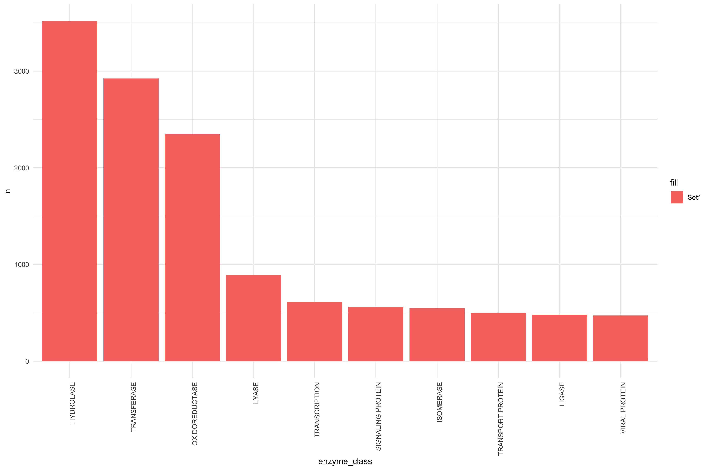

```{r setup, include=FALSE}
knitr::opts_chunk$set(echo = FALSE)
```

## Number of entries to the RCSB over time

- Linear regression using logarithmic y scale
- exponential growth phase (late 80's until 2000's)

{width=49%} {width=49%}

## Enzyme classes in the RCSB

- Analyzing biases in the RCSB

{width=75%}
